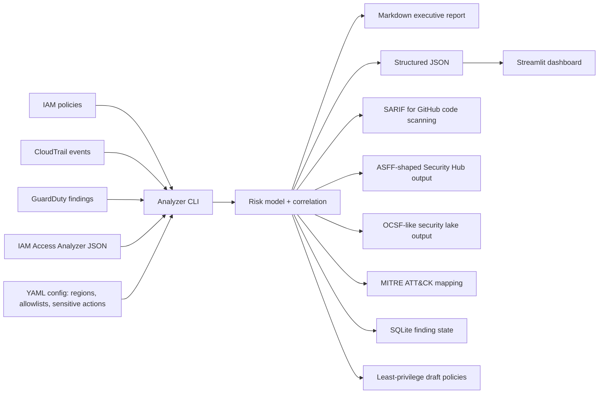

# AWS Cloud Security Scanner: IAM Risk, CloudTrail Triage, GuardDuty Correlation


> Security Engineer portfolio project for AWS cloud security, identity blast-radius analysis, threat detection, and least-privilege remediation.

This repository is a practical AWS security engineering lab. It analyzes realistic security telemetry and generates executive plus technical reports across:

- IAM misconfiguration detection
- CloudTrail behavior analysis
- GuardDuty finding triage
- IAM Access Analyzer JSON ingestion
- Least-privilege review draft generation
- Multi-source identity correlation
- SARIF output for GitHub code scanning
- ASFF-shaped output for AWS Security Hub style workflows
- OCSF-like normalized export for security data lake workflows
- MITRE ATT&CK Cloud mapping for detection engineering conversations
- SQLite finding state for deduplication over time
- Optional Bedrock executive summary path with local fallback
- S3/Athena ingestion helper templates for production-scale CloudTrail
- Terraform remediation review snippets
- Optional Docker, Lambda, and Streamlit dashboard demo

The goal is not another screenshot-based AWS lab. The goal is to show how a Security Engineer thinks: identity blast radius, runtime behavior, detection quality, remediation safety, reporting, and production gaps.

## Recommended GitHub repository name

Use this exact simple name for search visibility:

```text
aws-cloud-security-scanner
```

Good GitHub topics: `aws-security`, `cloud-security`, `iam-security`, `cloudtrail`, `guardduty`, `least-privilege`, `security-hub`, `sarif`, `asff`, `ocsf`, `mitre-attack`, `detection-engineering`, `security-engineering`.


---

## 30-second hiring-manager scan

| Signal | Evidence in this repo |
|---|---|
| IAM security | Detects wildcard actions/resources, PassRole risk, privilege escalation, broad trust policies, and missing MFA conditions |
| CloudTrail | Flags root usage, MFA gaps, IAM changes, denied calls, GuardDuty/CloudTrail tampering, suspicious user agents, and unusual regions |
| GuardDuty | Normalizes findings, extracts affected identities/resources, maps response actions |
| Access Analyzer | Ingests Access Analyzer-style findings and turns them into ranked engineering work |
| Least privilege | Builds review-only IAM policy drafts from observed CloudTrail behavior |
| Correlation | Builds incident storylines when the same identity appears across IAM, CloudTrail, GuardDuty, or Access Analyzer |
| Production mindset | SARIF, ASFF, OCSF, MITRE, YAML config, SQLite state, Dockerfile, Lambda skeleton, CI, tests, Terraform, dashboard |

---


## Production Hardening Added

This version includes hardening requested by QC review:

- Safe JSON loading with file existence, extension, malformed JSON, and size-limit checks.
- Pydantic-based input validation for CloudTrail, GuardDuty, IAM Access Analyzer, and YAML config.
- Structured logging support with `--json-logs` for CloudWatch-style pipelines.
- Fixed least-privilege policy generation so CloudTrail `iam.amazonaws.com:CreateAccessKey` becomes valid IAM action syntax `iam:CreateAccessKey`; non-policy sign-in events are excluded from generated policies.
- CLI error handling for missing files, malformed config, malformed JSON, and keyboard interruption.
- Expanded pytest suite with coverage gate, CLI error-path tests, output-format tests, and policy normalization tests.
- CI security checks: ruff, mypy, pytest coverage at 85%+, Bandit, pip-audit, Checkov/tfsec Terraform scans, SARIF upload, Dependabot, and pre-commit hooks.
- MITRE ATT&CK tags, OCSF-like export, finding deduplication state, JSONL streaming support, GuardDuty principal/resource extraction, and optional Bedrock summary path.

See `README-short.md` for a recruiter/interviewer 30-second scan.

## Architecture



---

## Quick start

```bash
python -m venv .venv
source .venv/bin/activate      # Windows: .venv\\Scripts\\activate
pip install -e .[dev]
./scripts/run_demo.sh
```

Or run the CLI directly:

```bash
aws-cloud-security-scanner analyze \
  --iam samples/iam_policies \
  --cloudtrail samples/cloudtrail/cloudtrail_events.json \
  --guardduty samples/guardduty/guardduty_findings.json \
  --access-analyzer samples/access_analyzer/findings.json \
  --config config/example.yml \
  --out reports/demo_report.md \
  --json-out reports/demo_report.json \
  --sarif-out reports/demo_report.sarif.json \
  --asff-out reports/demo_report.asff.json
reports/demo_report.ocsf.json
reports/ai_summary.md
reports/finding_state.sqlite \
  --ocsf-out reports/demo_report.ocsf.json \
  --state-db reports/finding_state.sqlite \
  --ai-summary-out reports/ai_summary.md
```

Run tests:

```bash
pytest --cov=src/cloudsec_aws_lab --cov-fail-under=85
ruff check src tests
```

Docker demo:

```bash
docker build -t aws-cloud-security-scanner .
docker run --rm -v "$PWD/reports:/app/reports" aws-cloud-security-scanner
```

Dashboard demo:

```bash
pip install streamlit pandas
streamlit run dashboard/app.py
```

---

## Example outputs

After running the demo, the repo generates:

```text
reports/demo_report.md
reports/demo_report.json
reports/demo_report.sarif.json
reports/demo_report.asff.json
reports/demo_report.ocsf.json
reports/ai_summary.md
reports/finding_state.sqlite
```

The Markdown report includes:

1. Executive summary
2. Impact metrics
3. Top risks ranked by severity
4. IAM, CloudTrail, GuardDuty, and Access Analyzer findings
5. Correlated identity-risk storylines
6. Least-privilege review drafts
7. Terraform remediation review snippets
8. Interview-ready security narrative

---

## Detection coverage

### IAM misconfiguration checks

- `Action: "*"`
- Service-wide wildcards like `iam:*`, `s3:*`, `kms:*`, `ec2:*`
- `Resource: "*"` on sensitive actions
- Privilege escalation actions:
  - `iam:PassRole`
  - `iam:AttachUserPolicy`
  - `iam:PutUserPolicy`
  - `iam:CreateAccessKey`
  - `sts:AssumeRole`
- Trust policies with broad principals
- Missing MFA conditions on sensitive access
- Overbroad S3/KMS/IAM permissions

### CloudTrail checks

- Root account usage
- Console login without MFA
- IAM policy changes
- Access key creation
- Failed authorization attempts
- GuardDuty disabling attempts
- CloudTrail stop/delete attempts
- KMS destructive actions
- Suspicious user agents
- API calls from uncommon regions

### GuardDuty checks

- Severity normalization
- Affected principal extraction
- Affected resource extraction
- Finding-to-remediation mapping
- Cross-source correlation by identity

### IAM Access Analyzer support

- Ingests exported findings/policy validation JSON
- Converts Access Analyzer issues into ranked findings
- Uses findings to support least-privilege planning
- Includes review-only policy generation helper

---

## Why this is stronger than a normal AWS lab

Most portfolio labs stop at "I enabled GuardDuty" or "I created a vulnerable IAM policy." This project acts like a small internal cloud-security tool:

- It separates analyzers, reporting, risk model, correlation, and remediation.
- It produces machine-readable outputs that could plug into CI/CD or Security Hub workflows.
- It calls out production gaps instead of pretending sample data equals production readiness.
- It connects identity design, telemetry behavior, and alert triage into one storyline.

---

## Production gaps and roadmap

This project is intentionally safe and local by default. In production, the next steps would be:

- S3 and Athena ingestion for large CloudTrail lakes
- EventBridge near-real-time detection mode
- AWS Organizations support for multi-account analysis
- SCP, permission boundary, session policy, ABAC, and IAM Identity Center coverage
- IAM Access Analyzer API integration for generated policies and unused access
- Security Hub `BatchImportFindings` integration
- OCSF mapping and finding deduplication
- Bedrock/Claude-assisted triage summaries with privacy guardrails
- CIS AWS Foundations, NIST, SOC2, and MITRE ATT&CK Cloud mapping

See `docs/production-roadmap.md` for the full roadmap.

---

## Interview positioning

Use this repo to say:

> I built a Python-based AWS cloud security lab that detects IAM misconfigurations, analyzes CloudTrail behavior, triages GuardDuty findings, ingests IAM Access Analyzer exports, correlates identity risk across sources, and produces least-privilege remediation reports in Markdown, JSON, SARIF, and ASFF-style formats.

Recommended GitHub description:

> AWS cloud security lab for IAM risk analysis, CloudTrail threat hunting, GuardDuty triage, Access Analyzer findings, and least-privilege remediation.

Recommended GitHub topics:

```text
aws cloud-security iam cloudtrail guardduty terraform least-privilege access-analyzer security-hub sarif asff threat-detection security-engineering python
```

---

## Safety note

This project uses local sample data by default and does not require AWS credentials. If extended to real AWS accounts, use read-only roles, anonymize logs, and never commit credentials, account IDs, access keys, session tokens, or production CloudTrail data.

## Public Launch Polish

- Simple search-friendly repo name: `aws-cloud-security-scanner`.
- YAML suppression rules and severity overrides for known business exceptions.
- Optional IAM Access Analyzer API ingestion through `--access-analyzer-api`.
- JSONL streaming for larger CloudTrail exports.
- S3/Athena workflow documented in `docs/s3-athena-access-analyzer.md`.
- Bedrock summaries are opt-in; local executive summary is the safe default.
- Reusable composite GitHub Action lives in `.github/actions/aws-cloud-security-scan`.
- EventBridge/Lambda deployment skeleton lives in `terraform/eventbridge_lambda`.
